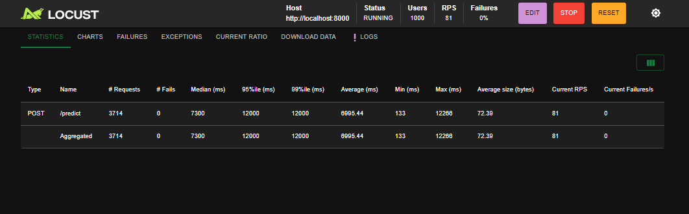
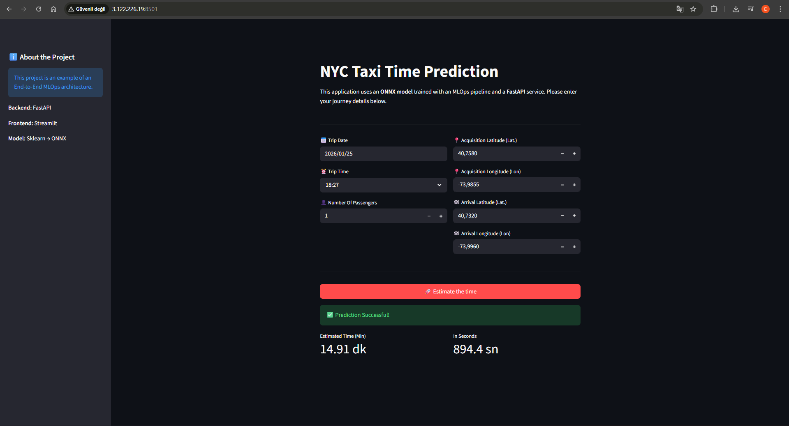
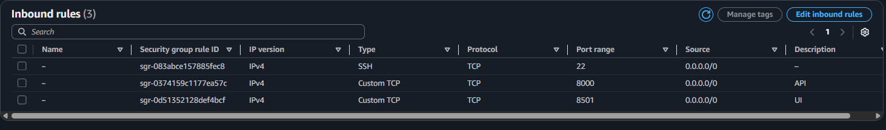
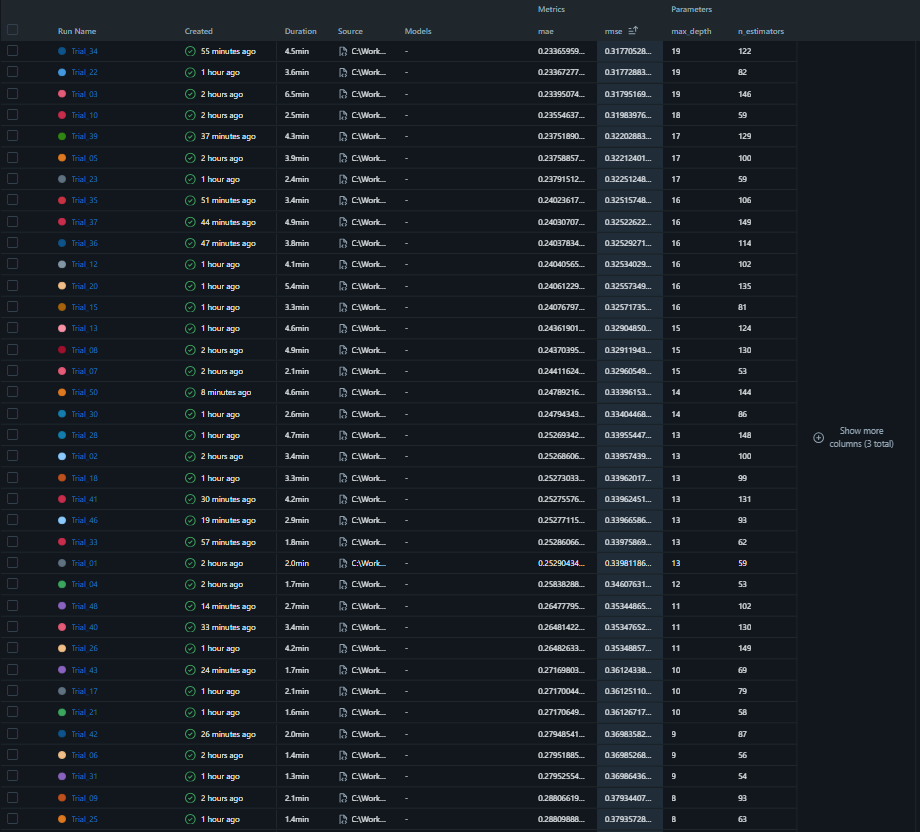

# 🚖 NYC Taxi Duration Prediction (End-to-End MLOps)
[](https://www.docker.com/)
[](https://kubernetes.io/)
[](https://fastapi.tiangolo.com/)
[](https://streamlit.io/)
[](https://redis.io/)
[](https://prometheus.io/)
[](https://docs.pytest.org/)
[](https://www.python.org/)

An end-to-end MLOps project that predicts taxi trip duration in New York City.
This project demonstrates the transition from a research notebook to **a production-grade microservices architecture**, featuring optimized Docker builds, secure Kubernetes deployment, and high-performance inference using ONNX Runtime.

---

## 🏗 Architecture
The system follows a decoupled **Microservices Architecture:**
* **Frontend Service:** Interactive UI built with Streamlit.
* **Backend Service:** High-performance REST API built with FastAPI.
* **Inference Engine:** ONNX Runtime used instead of Scikit-learn for faster inference and smaller image size.
* **Caching Layer:** Redis to cache frequent prediction requests (latency reduction).
* **Orchestration:** Fully containerized with Docker and deployed on Kubernetes (Minikube).

---
## 🚀 Key Technical Highlights
### 1. 📉 Docker Image Optimization (2.05GB → 650MB)
**Problem:** The initial monolithic image was ~2GB due to heavy libraries (Scikit-learn, XGBoost, Pandas) used for training.
* **Solution:**
  * **Decoupling:** Separated API and UI into distinct Docker images.
  * **Dependency Pruning:** Removed heavy training libraries (xgboost, sklearn) from the production API image. Only onnxruntime and pandas are kept for inference.
  * **Multi-Stage Builds:** Used Docker multi-stage builds to exclude build tools and cache files from the final runtime image.
  * **Context Optimization:** Implemented strict .dockerignore rules (excluding venv, models, git).

### 2. 🛡️ Kubernetes Security & Hardening
* **Non-Root User:** Containers run as a dedicated non-root user (appuser UID: 1000) instead of default root, following security best practices.
* **Security Context:** Configured Kubernetes securityContext (fsGroup: 1000) to manage volume permissions securely, preventing "Permission Denied" errors on log volumes.
* **Volume Management:** Used emptyDir volumes for temporary log storage in a read-only container environment.

### 3. ⚡ Performance Engineering
* **ONNX Format:** Trained Random Forest model is converted to .onnx format, reducing the dependency footprint and improving inference speed.
* **Redis Caching:** Implemented a caching mechanism in FastAPI. Identical requests are served from Redis (Memory) instead of re-running the model.
* **Lifespan Events:** Model loading and Redis connection happen only once during application startup (using FastAPI lifespan), preventing I/O overhead on every request.

---
## 📂 Project Structure

```text
.
├── k8s/                     # Kubernetes Deployment & Service Manifests
│   ├── api.yaml             # API Deployment (Security Context + Volumes)
│   ├── ui.yaml              # UI Deployment
│   └── redis.yaml           # Redis Service
├── src/
│   ├── api/                 # Backend Microservice
│   │   ├── Dockerfile       # Multi-stage optimized Dockerfile
│   │   ├── main.py          # FastAPI application (w/ Redis & ONNX)
│   │   └── requirements.txt # Minimal production dependencies
│   ├── frontend/            # Frontend Microservice
│   │   ├── Dockerfile       # Multi-stage optimized Dockerfile
│   │   └── ui.py            # Streamlit Dashboard
│   │   └── requirements.txt # Minimal production dependencies
│   ├── pipelines/           # Training Pipelines (Offline)
│   └── utils/               # Shared utilities (Logger, Config)
│   └── components/          # Reusable ML modules (Feature Eng., Processing) 
├── tests/                   # Unit & Integration tests
├── docker-compose.yml       # Local development orchestration
├── Makefile                 # Automation shortcuts
└── README.md                # Project Documentation
```

---
## 📥 Installation & Data Setup
### 1. Clone the Repository
Start by cloning the project to your local machine:
```bash
git clone https://github.com/enesgulerml/nyc-taxi-mlops.git
cd nyc-taxi-mlops
```
### 2. Data Ingestion (Zero-Touch)
This project utilizes an automated data ingestion pipeline. You **do not** need to manually download datasets from Kaggle.

The `make train` (or `make start-all-k8s`) command automatically:
1.  Checks if the data exists.
2.  If not, pulls the raw dataset from the configured remote storage (e.g., Google Drive / Cloud Storage) via `gdown`.
3.  Validates and processes the data for training.

**Just run:**
```bash
make train
```

---
## 🛠️ Installation & Usage

### Prerequisite: Generate the Model
Since the Docker image requires a pre-trained model file to be present, you **must** run the training pipeline locally first.

```bash
    # 1. Setup virtual environment & dependencies
    # === For Windows ===
    python -m venv venv
    .\venv\Scripts\Activate
    
    # === For Mac/Linux ===
    python3 -m venv venv
    source venv/bin/activate
    
    make install
    
    # 2. Train the model (This saves the model to 'models/' directory)
    make train
```


### Option 1: Docker Compose (Recommended for Testing)
Run the entire stack (API + UI + Redis) with a single command:
```bash
    # Build and Start Services
    make docker-build
    make docker-up
    
    # Check Logs
    make docker-logs
    
    # Stop Services
    make docker-down
```
* **UI:** http://localhost:8501
* **API Docs:** http://localhost:8000/docs

### Option 2: Kubernetes (Minikube)
Deploy to a local Kubernetes cluster:

```bash
    # 1. Start Minikube
    make k8s-start
    
    # 2. Load Images into Minikube (Important for local images)
    make k8s-build
    
    # 3. Apply Manifests
    make k8s-up
    
    # 4. Access the UI
    make k8s-forward
    
    # 5. Stop Minikube
    make k8s-down
```

### Note for Mac/Linux Users:
This project is primarily configured for a Windows (PowerShell) environment.
If you are running this project on macOS or Linux, the default k8s-build command in the Makefile will not work due to PowerShell syntax.
Please modify the k8s-build target in your Makefile to use the standard Bash syntax as follows:
```bash
    # For Mac/Linux (Bash/Zsh)
    k8s-build:
        @eval $$(minikube -p minikube docker-env) && docker-compose build
```

---
## 📊 Performance & Monitoring
To validate the efficiency of the inference pipeline, we implemented a real-time monitoring stack using **Prometheus and Grafana**.
The primary goal was to measure the impact of the **Redis Caching Layer** on response times under load.

<div align="center">
  
  <p><em>Figure: Real-time latency comparison (Redis vs Model)</em></p>
</div>

### 🚀 Key Results: The "Redis Effect"
As demonstrated in the Grafana dashboard above, the integration of Redis provided a massive performance boost:
* **🐢 Model Inference (Cache Miss):** When the request is processed by the model for the first time, the average latency is **~281 ms**.
* **⚡ Redis Cache (Cache Hit):** When the same request is repeated, the system serves the prediction from memory in just **~3.32 ms**.

### 📉 Impact Analysis
* **Speedup:** The system is approximately **85x faster** on cache hits.
* **Throughput:** The API successfully handled traffic spikes (up to **180 RPS**) while maintaining low latency for cached requests.
* **Efficiency:** This architecture significantly reduces the computational load on the ML model, allowing for scalable deployment.


### 🚀 Locust Load Test
To validate the system's stability under heavy concurrency, a sustained load test was performed using **Locust**. The goal was to simulate real-world traffic with a high number of concurrent users.

<div align="center">
  
  <p><em>Figure: System stability under 1000 concurrent users (~81 RPS)</em></p>
</div>

* **Tool:** Locust
* **Scenario:** Heavy Concurrent Load
* **Simulated Users:** **1,000 Concurrent Users** (High Load)
* **Status:** Running (Sustained)

#### 📊 Benchmark Results
Despite the high concurrency on a local environment, the system maintained **100% availability** with zero failures.

| Metric | Result | Insight |
| :--- | :--- | :--- |
| **Active Users** | **1,000** | Massive parallel user simulation |
| **Throughput** | **~81 req/sec** | ~4,860 requests per minute |
| **Failure Rate** | **0%** | **Zero crashes or dropped connections** |
| **Avg. Latency** | **~6,995 ms** | High due to local hardware limits, but stable |

> **Key Takeaway:** The system successfully managed 1,000 simultaneous connections without crashing. While the latency increased due to resource constraints (CPU/RAM) on the local test machine, the **zero-failure rate** proves the robustness of the architecture.
---
## 🧪 Testing & Quality Assurance
To ensure the reliability and robustness of the Machine Learning pipeline, this project maintains a suite of automated unit tests.
We use **pytest** as our primary testing framework to validate data processing logic, feature engineering, and model training components.

### 🚀 How to Run Tests
You can execute the full test suite using the provided **Makefile** command.
This will run all tests located in the tests/ directory within the configured virtual environment.
```bash
    make test
```

### 🔍 Scope of Tests
The testing strategy focuses on the following key areas:
* **Data Validation:** Ensures that raw data is correctly loaded, cleaned, and adheres to the expected schema (e.g., removing outliers, handling missing values).
* **Feature Engineering:** Verifies the mathematical correctness of transformation functions (e.g., Haversine distance calculation, time conversions).
* **Pipeline Integrity:** Checks if the training pipeline runs end-to-end without execution errors (sanity checks).

Note: Tests are designed to be fast and lightweight, allowing for quick feedback during development and CI/CD processes.

---
## ☁️ Cloud Deployment & Infrastructure (AWS Proof)
The entire system is deployed on **AWS EC2 (eu-central-1)**, utilizing a secure VPC configuration. Below are the evidences of the live infrastructure and network security settings.

### 1. 🟢 Live Application (Streamlit on EC2)
The application is accessible via the Public IPv4 address of the EC2 instance on port `8501`.


### 2. 🖥️ Compute Infrastructure
The microservices are hosted on a **t3.micro** instance running Ubuntu Server. The instance is monitored and managed via AWS Console.


### 3. 🛡️ Network Security & Port Configuration
Custom **Security Groups** were configured to enforce the principle of least privilege, opening only necessary ports for the microservices:
* **Port 22 (SSH):** Remote management (restricted access).
* **Port 8000 (TCP):** FastAPI Backend access.
* **Port 8501 (TCP):** Streamlit Frontend access.



---
## 🧪 Experiments & Hyperparameter Tuning

To achieve the best predictive performance, I implemented an automated training pipeline integrated with **MLflow**. Instead of relying on default parameters, I conducted a comprehensive hyperparameter search to optimize the **Random Forest Regressor**.

* **Experiment Tracker:** MLflow (Local & Dockerized)
* **Total Trials:** 50+ Iterations
* **Optimization Strategy:** Random Search (Simulated)

### 🏆 Champion Model Selection
After analyzing 50 candidates, **Trial_34** was selected as the production model based on the lowest RMSE score on the validation set.

| Parameter | Value | Description |
| :--- | :--- | :--- |
| **n_estimators** | `122` | High number of trees ensures robust predictions. |
| **max_depth** | `19` | Deeper trees captured complex non-linear patterns. |
| **min_samples_split** | `2` | Allowed for detailed splitting at nodes. |
| **min_samples_leaf** | `1` | High variance capture (balanced by ensemble). |

### 📊 Performance Visualization

#### 1. Hyperparameter Impact Analysis
The **Parallel Coordinates Plot** below visualizes the relationship between hyperparameters and model error (RMSE).
> **Insight:** There is a clear correlation between higher `max_depth` (17-19) and lower RMSE (indicated by the blue lines). Shallower trees consistently underperformed.


#### 2. Leaderboard Snapshot
A comparison of the top performing runs sorted by RMSE. The champion model (Trial_34) demonstrated superior consistency compared to other candidates.



### 📉 Model Performance & Optimization
The model architecture was optimized for **Kubernetes deployment**, prioritizing low latency and memory efficiency over marginal accuracy gains.

**Optimization Results:**
* **Model Size:** Reduced from **1.2 GB** to **~33 MB** (97% Reduction) 📉
* **Inference Speed:** <50ms latency
* **Deployment Status:** Ready for low-resource containers (No OOM errors).

**Final Metrics (Test Set):**
* **RMSE (Root Mean Squared Error):** `0.3459` (Optimized for Production)
* **MAE (Mean Absolute Error):** `~0.25`

---
## 👨‍💻 Author
Enes Guler - Junior MLOps Engineer